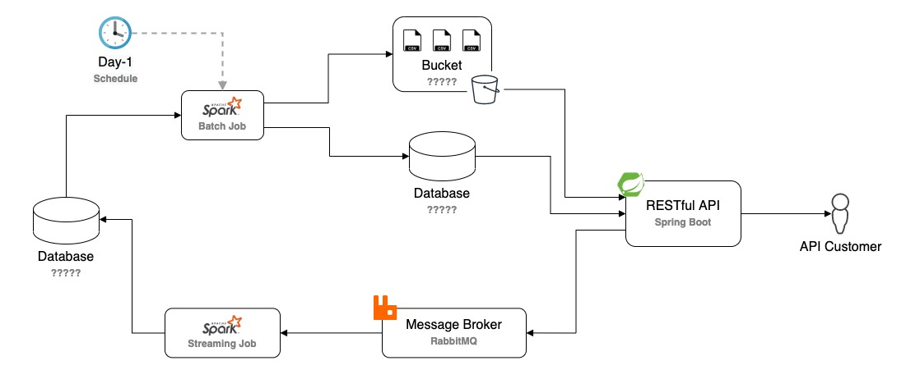

# DMesh
By Anthony Vilarim Caliani


`TODO` Add a description about the idea and about the project.<br>



## Quick Start
```bash
docker-compose up -d
# TODO... Mock Stuff
```

### Development Details
 - [DMesh API](./dmesh-api/README.md)
 - [Spark Jobs](./dmesh-jobs/README.md)

## Related Links
- [Docker Hub: RabbitMQ](https://hub.docker.com/_/rabbitmq)
- [Docker Hub: MySQL](https://hub.docker.com/_/mysql)
- [Kaggle: e-Commerce Data](https://www.kaggle.com/carrie1/ecommerce-data)
- [Medium: RabbitMQ + Docker](https://medium.com/xp-inc/rabbitmq-com-docker-conhecendo-o-admin-cc81f3f6ac3b)
